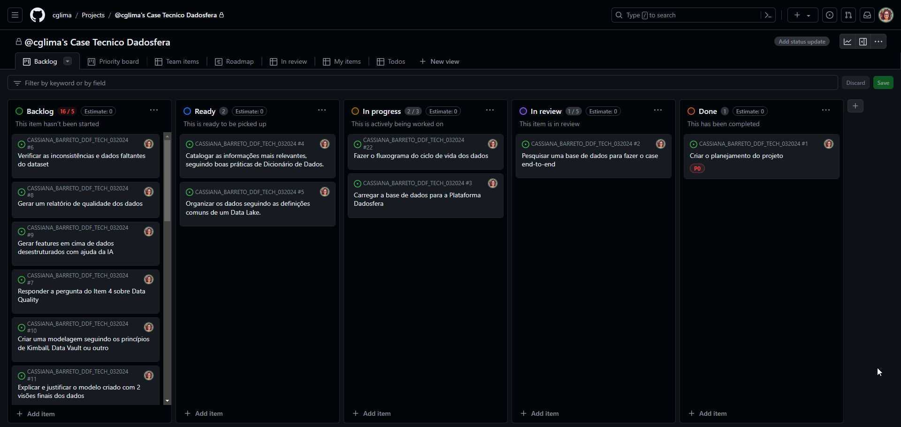

# Case Tecnico Base - v2.0 Dadosfera

Ciclo de vida dos dados

## Item 0 - Sobre Agilidade e Planejamento

### Concepção e Planejamento

- [x] Criar o planejamento do projeto

- [Link para o projeto Kanban Board](https://github.com/users/cglima/projects/6/views/1)
  

## Item 1 - Sobre a Base de Dados

- [x] Pesquisar uma base de dados para fazer o case end-to-end

Escolhi a base de dados [Microsoft AdventureWorks - DataBase](https://learn.microsoft.com/en-us/sql/samples/adventureworks-install-configure?view=sql-server-ver16&tabs=ssms)

[Documentação do banco de dados Microsoft AdventureWorks](https://dataedo.com/download/AdventureWorks.pdf)

## Item 2 - Sobre a Dadosfera - Integrar

- [x] Carregar a base de dados para a Plataforma Dadosfera
- [ ] **Bonus: Carregue seus dados numa base transacional SQL, importe para a Dadosfera e aplique uma microtransformação**

## Item 3 - Sobre a Dadosfera - Explorar

- [x] Catalogar as informações mais relevantes, seguindo boas práticas de Dicionário de Dados.
- [Link para acesso ao catalogo](https://app.dadosfera.ai/pt-BR/catalog/data-assets)

- [x] Organizar os dados seguindo as definições comuns de um Data Lake

## Item 4 - Sobre Data Quality

- [x] Verificar as inconsistências e dados faltantes do dataset
- [x] Responder a pergunta do Item 4 sobre Data Quality [Link para a resposta](resposta-item4.md)
- [x] Gerar um relatório de **qualidade dos dados** [Link para o relatório qualidade dos dados](quality-date.ipynb)
- [ ] **Bonus: Definir e implementar um Common Data Model para os dados utilizados**

## Item 5 - Sobre o uso de GenAI e LLMs - Processar

- [ ] Gerar features em cima de dados desestruturados com ajuda da IA
- [ ] **Bonus: Usar Video ou Audio como exemplo deste item do case**

## Item 6 - Sobre Modelagem de Dados

- [ ] Criar uma modelagem seguindo os princípios de Kimball, Data Vault ou outro
- [ ] Explicar e justificar o modelo criado com 2 visões finais dos dados
- [ ] **Bonus: desenhe o diagrama representando as camadas finais do DW proposto.**