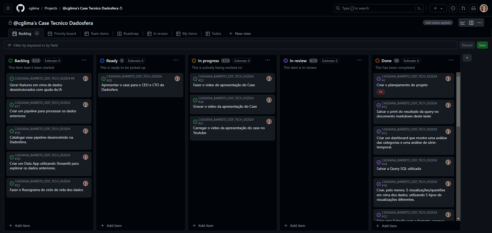
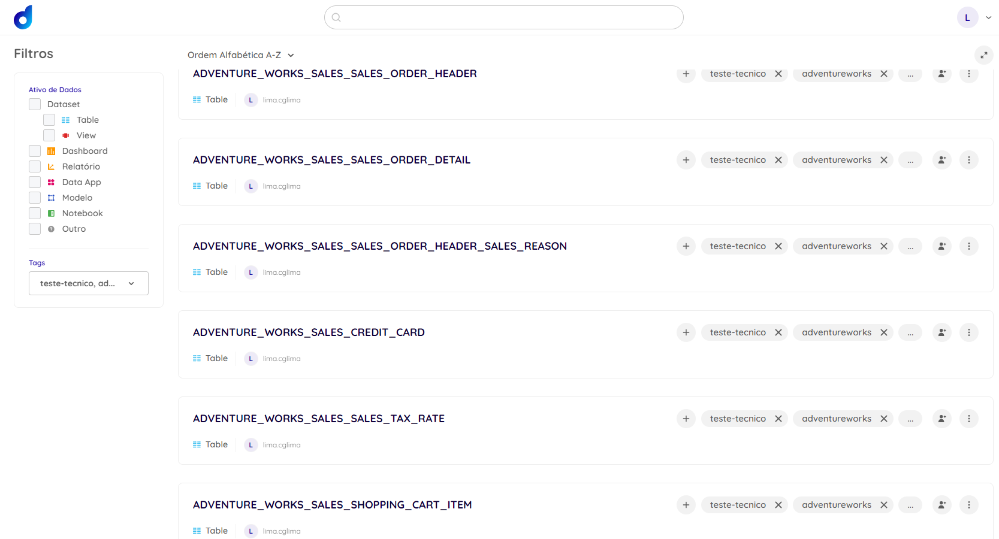
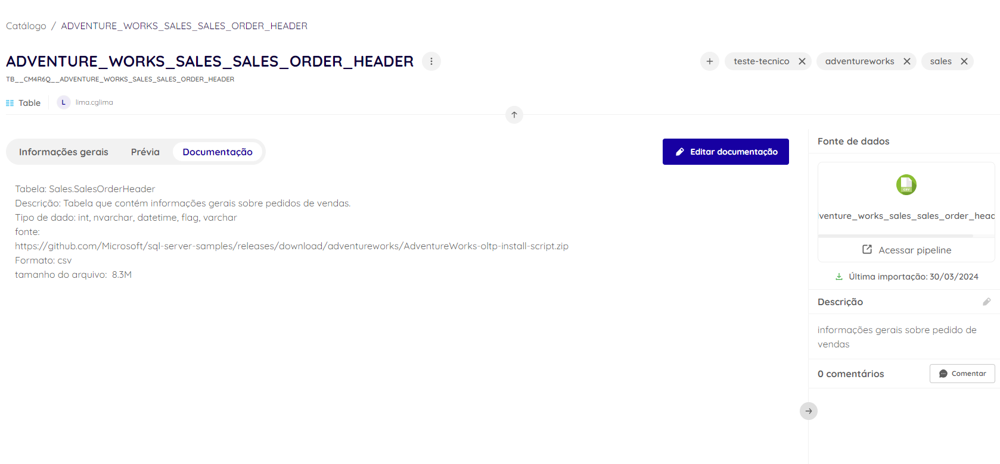
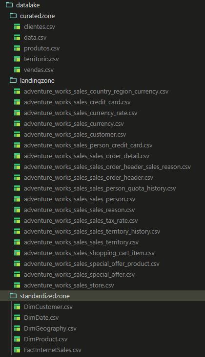

# Case Tecnico Base - v2.0 Dadosfera

Ciclo de vida dos dados

## Item 0 - Sobre Agilidade e Planejamento

### Concepção e Planejamento

- [x] Criar o planejamento do projeto

- [Link para o projeto Kanban Board](https://github.com/users/cglima/projects/6/views/1)
  

## Item 1 - Sobre a Base de Dados

- [x] Pesquisar uma base de dados para fazer o case end-to-end

Escolhi a base de dados [Microsoft AdventureWorks - DataBase](https://learn.microsoft.com/en-us/sql/samples/adventureworks-install-configure?view=sql-server-ver16&tabs=ssms)

[Documentação do banco de dados Microsoft AdventureWorks](https://dataedo.com/download/AdventureWorks.pdf)

## Item 2 - Sobre a Dadosfera - Integrar

- [x] Carregar a base de dados para a Plataforma Dadosfera
- [ ] **Bonus:** Carregue seus dados numa base transacional SQL, importe para a Dadosfera e aplique uma microtransformação

## Item 3 - Sobre a Dadosfera - Explorar

- [x] Catalogar as informações mais relevantes, seguindo boas práticas de Dicionário de Dados.
- [Link para acesso ao catalogo](https://app.dadosfera.ai/pt-BR/catalog/data-assets)

- [x] Organizar os dados seguindo as definições comuns de um Data Lake

## Item 4 - Sobre Data Quality

- [x] Verificar as inconsistências e dados faltantes do dataset
- [x] Responder a pergunta do Item 4 sobre Data Quality [Link para a resposta](resposta-item4.md)
- [x] Gerar um relatório de **qualidade dos dados** [Link para o relatório qualidade dos dados](quality-date.ipynb)
- [ ] **Bonus:** Definir e implementar um Common Data Model para os dados utilizados

## Item 5 - Sobre o uso de GenAI e LLMs - Processar

- [ ] Gerar features em cima de dados desestruturados com ajuda da IA
- [ ] **Bonus:** Usar Video ou Audio como exemplo deste item do case

## Item 6 - Sobre Modelagem de Dados

- [x] Criar uma modelagem seguindo os princípios de Kimball, Data Vault ou outro - [Link para a resposta](modelagem-dados.md)
- [x] Explicar e justificar o modelo criado com 2 visões finais dos dados - [Link para a resposta](modelagem-dados.md)
- [ ] **Bonus:** desenhe o diagrama representando as camadas finais do DW proposto

## Item 7 -  Sobre Análise de Dados - Analisar

- [x] Criar uma Coleção com o formato <nome> <sobrenome> - <mes_ano>
- [x] Criar um dashboard que mostre uma análise das categorias e uma análise de série-temporal
- [x] Salvar a Query SQL utilizada [Link para as queries SQL Dashboard](queriesdashboard.md)
- [x] Salvar o print do resultado da query no documento markdown deste teste
- [x] Criar, pelo menos, 5 visualizações/questões em cima dos dados, utilizando 5 tipos de visualizações diferentes

[Link para o meu Metabase](https://metabase-treinamentos.dadosfera.ai/collection/417-cassiana-barreto-032024)

## Item  8 - Sobre Pipelines

- [ ] Criar um pipeline para processar os dados anteriores
- [ ] Catalogar esse pipeline desenvolvido na Dadosfera

## Item 9 - Sobre Data Apps

- [ ] Criar um Data App utilizando Streamlit para explorar os dados anteriores
  
## Item 10 - Apresentação do Case

- [x] Fazer a apresentação do Case
- [ ] Gravar a apresentação do Case
- [ ] Carregar o vídeo da apresentação do case no Youtube
- [ ] Apresentar o case para o CEO e CTO da Dadosfera
