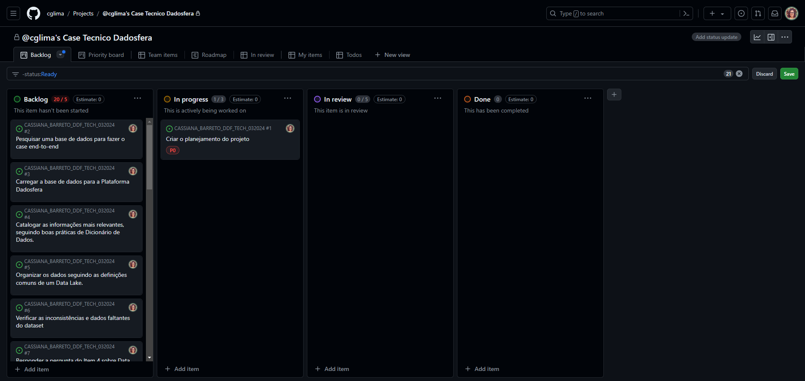

# Case Tecnico Base - v2.0 Dadosfera

Ciclo de vida dos dados

## Item 0 - Sobre Agilidade e Planejamento

### Concepção e Planejamento

- [x] Criar o planejamento do projeto

- [Link para o projeto Kanban Board](https://github.com/users/cglima/projects/6/views/1)
  

## Item 1 - Sobre a Base de Dados

- [ ] Pesquisar uma base de dados para fazer o case end-to-end
