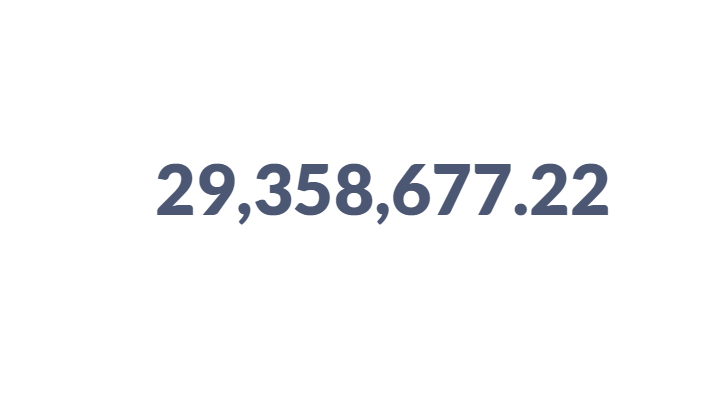
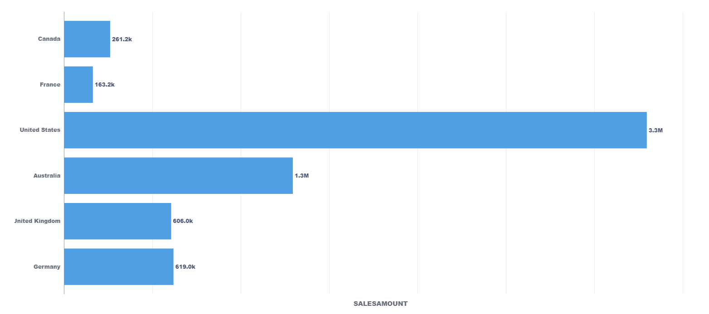
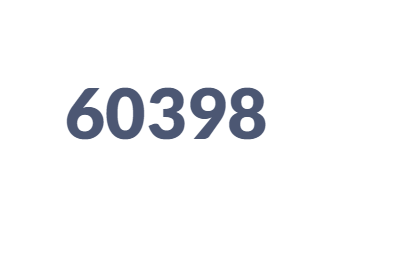
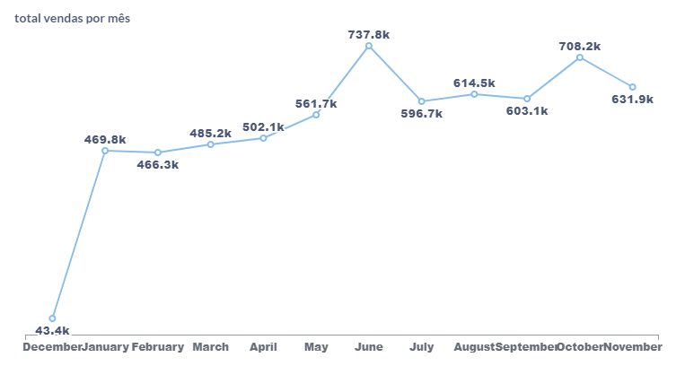
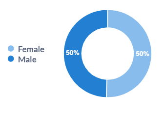
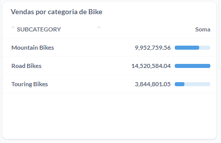
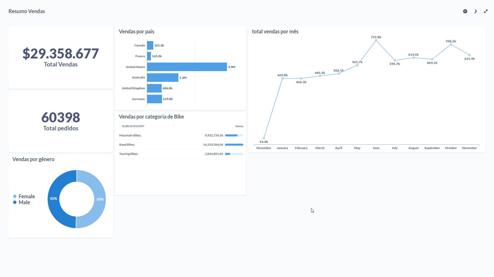

# Queries SQL do Dashboard

## Perguntas 

1. Qual é o valor total das vendas

``` sql
SELECT SUM("PUBLIC"."TB__4P5ATN__FINAL_ADVENTURE_WORKS_VENDAS"."SALESAMOUNT") AS "sum"
FROM "DADOSFERA_PRD_TREINAMENTOS"."PUBLIC"."TB__4P5ATN__FINAL_ADVENTURE_WORKS_VENDAS"
```



2. Vendas por país

``` sql
SELECT "PUBLIC"."TB__4P5ATN__FINAL_ADVENTURE_WORKS_VENDAS"."SALESAMOUNT" AS "SALESAMOUNT", "Tb Eoon5z Final Adventure Works Localizacao"."PAIS" AS "Tb Eoon5z Final Adventure Works Localizacao__PAIS"
FROM "DADOSFERA_PRD_TREINAMENTOS"."PUBLIC"."TB__4P5ATN__FINAL_ADVENTURE_WORKS_VENDAS"
LEFT JOIN "DADOSFERA_PRD_TREINAMENTOS"."PUBLIC"."TB__EOON5Z__FINAL_ADVENTURE_WORKS_LOCALIZACAO" AS "Tb Eoon5z Final Adventure Works Localizacao" ON "PUBLIC"."TB__4P5ATN__FINAL_ADVENTURE_WORKS_VENDAS"."SALESTERRITORYKEY" = "Tb Eoon5z Final Adventure Works Localizacao"."SALESTERRITORYKEY"
```



3. Total de pedidos

```sql
SELECT SUM("PUBLIC"."TB__4P5ATN__FINAL_ADVENTURE_WORKS_VENDAS"."ORDERQUANTITY") AS "sum"
FROM "DADOSFERA_PRD_TREINAMENTOS"."PUBLIC"."TB__4P5ATN__FINAL_ADVENTURE_WORKS_VENDAS"
```



4. Total de vendas por mês

```sql
SELECT "PUBLIC"."TB__4P5ATN__FINAL_ADVENTURE_WORKS_VENDAS"."SALESAMOUNT" AS "SALESAMOUNT", "Tb 57wf9k Final Adventure Works Data"."MES" AS "Tb 57wf9k Final Adventure Works Data__MES"
FROM "DADOSFERA_PRD_TREINAMENTOS"."PUBLIC"."TB__4P5ATN__FINAL_ADVENTURE_WORKS_VENDAS"
LEFT JOIN "DADOSFERA_PRD_TREINAMENTOS"."PUBLIC"."TB__57WF9K__FINAL_ADVENTURE_WORKS_DATA" AS "Tb 57wf9k Final Adventure Works Data" ON "PUBLIC"."TB__4P5ATN__FINAL_ADVENTURE_WORKS_VENDAS"."DATA_PEDIDO" = "Tb 57wf9k Final Adventure Works Data"."DATA"
```



5. Vendas por gênero

``` sql
SELECT "Tb Gqiw31 Final Adventure Works Cliente"."SEXO" AS "Tb Gqiw31 Final Adventure Works Cliente__SEXO", SUM("PUBLIC"."TB__4P5ATN__FINAL_ADVENTURE_WORKS_VENDAS"."SALESAMOUNT") AS "sum"
FROM "DADOSFERA_PRD_TREINAMENTOS"."PUBLIC"."TB__4P5ATN__FINAL_ADVENTURE_WORKS_VENDAS"
LEFT JOIN "DADOSFERA_PRD_TREINAMENTOS"."PUBLIC"."TB__GQIW31__FINAL_ADVENTURE_WORKS_CLIENTE" AS "Tb Gqiw31 Final Adventure Works Cliente" ON "PUBLIC"."TB__4P5ATN__FINAL_ADVENTURE_WORKS_VENDAS"."CUSTOMERKEY" = "Tb Gqiw31 Final Adventure Works Cliente"."CUSTOMERKEY"
GROUP BY "Tb Gqiw31 Final Adventure Works Cliente"."SEXO"
ORDER BY "Tb Gqiw31 Final Adventure Works Cliente"."SEXO" ASC
``` 



6. Vendas por categoria de Bike

```sql
SELECT "PUBLIC"."TB__6871RC__FINAL_ADVENTURE_WORKS_PRODUTOS"."SUBCATEGORY" AS "SUBCATEGORY", SUM("Tb 4p5atn Final Adventure Works Vendas"."SALESAMOUNT") AS "sum"
FROM "DADOSFERA_PRD_TREINAMENTOS"."PUBLIC"."TB__6871RC__FINAL_ADVENTURE_WORKS_PRODUTOS"
LEFT JOIN "DADOSFERA_PRD_TREINAMENTOS"."PUBLIC"."TB__4P5ATN__FINAL_ADVENTURE_WORKS_VENDAS" AS "Tb 4p5atn Final Adventure Works Vendas" ON "PUBLIC"."TB__6871RC__FINAL_ADVENTURE_WORKS_PRODUTOS"."PRODUCTKEY" = "Tb 4p5atn Final Adventure Works Vendas"."PRODUCTKEY"
WHERE "PUBLIC"."TB__6871RC__FINAL_ADVENTURE_WORKS_PRODUTOS"."CATEGORY" = 'Bikes'
GROUP BY "PUBLIC"."TB__6871RC__FINAL_ADVENTURE_WORKS_PRODUTOS"."SUBCATEGORY"
ORDER BY "PUBLIC"."TB__6871RC__FINAL_ADVENTURE_WORKS_PRODUTOS"."SUBCATEGORY" ASC
```



## Dashboard

